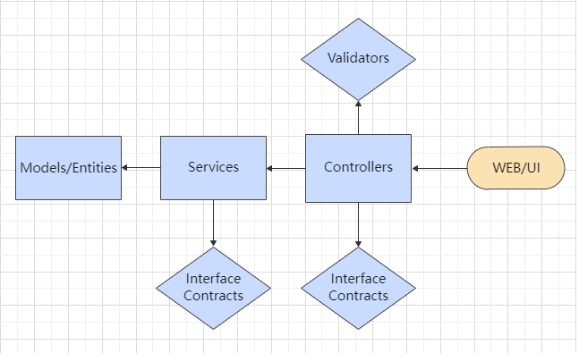

## Laravel - Lista de Compras

Caro Orientador,

Meu objetivo principal com essa aplicação simples de lista de compras é implementá-la em um ambiente simulado de um _Cluster Kubernetes_ utilizando. Utilizar de load balance, escalonamento automático e outras _features_ fornecidas pelo _Cluster Kubernetes_

Essa primeira versão da aplicação consta com autenticação e duas entidades prontas. O intuito dessa primeira versão é mostrar o modelo/arquitetura que estou usando no desenvolvimento. 

Minha motivação foi para utilizar o conceito de Clean Architecture (vide artigo do Uncle Bob), onde as regras de dependências exigem que estas sejam feitas de "fora pra dentro". Algo declarado na camada mais externa não pode ser utilizado pelo código na camada mais interna. Isso inclui funções, classes ou quaisquer outras entidades do software.

    Ex:   
        Persistência/Models <- Repositories <- Services (regras de negócio/casos de uso) <- Controllers <- Mundo Externo.

Tomei a liberdade de remover a camada _Repository_, levando em conta que a aplicação possui regras de negócio bem simples. A abstração tanto da regra de negócio quanto do acesso a camada de persistência ficará a cargo dos _Services_. Caso fosse uma aplicação mais robusta, incluiria a camada de _Repository_ para lidar somente e diretamente com a camada de persistência. 
_____
Fortaleci este modelo com princípios de S.O.L.I.D. 

As classes estão enxutas, com somente o que condiz com suas responsabilidades. Criei _interfaces_ para os _Services_ e _Controllers_, forçando uma implementação específica dos métodos para que toda a aplicação fique homogênea. 

A base de dados é criada através de _Migrations_ versionadas (database/migrations).

A implementação do _Cluster_ será o último passo do desenvolvimento. Ao término do desenvolvimento, incluirei neste documento o passo-a-passo para montar todo o ambiente.

    lista de compras v.1 14/03

- Laravel 8
- php 8
- mysql 8

